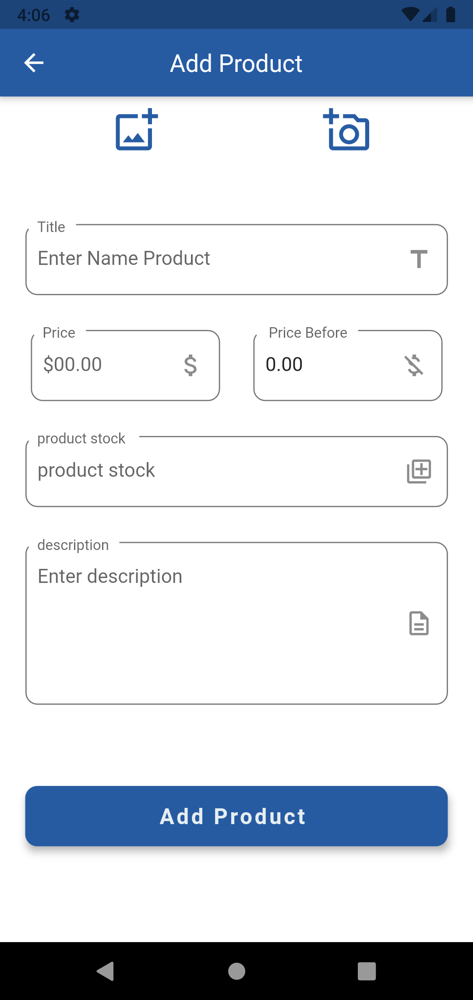

# E-commerce Task


## Getting Started
 
## Packages Used
```
 image_picker: ^0.8.1+1
 flutter_svg: ^0.22.0 #-nullsafety.3
 sqflite: ^2.0.0+4
 provider:
 cupertino_icons: ^1.0.2
 flutter_launcher_icons:

 
````
### Screenshots

 
 
